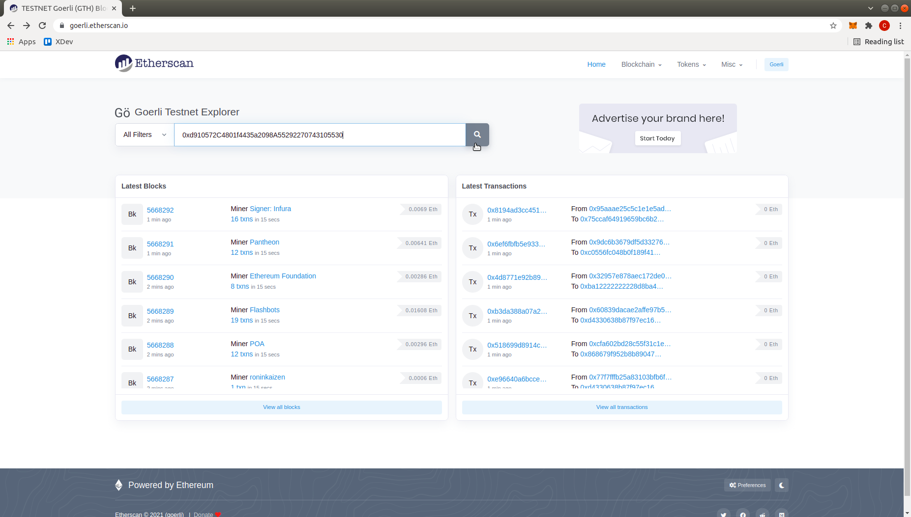
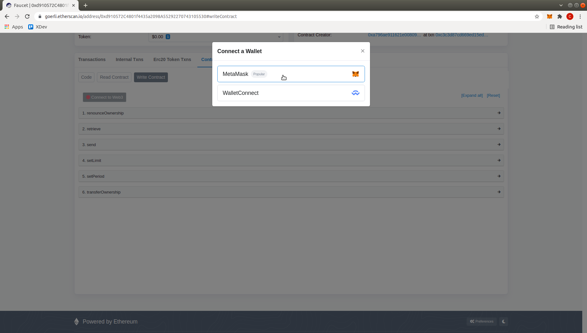
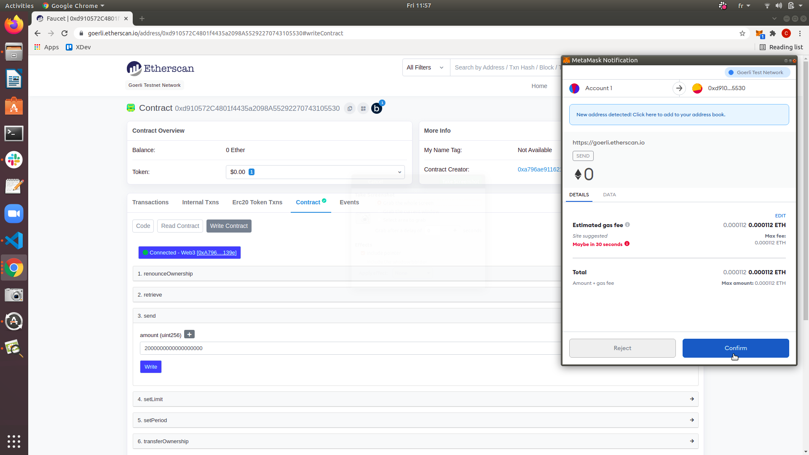
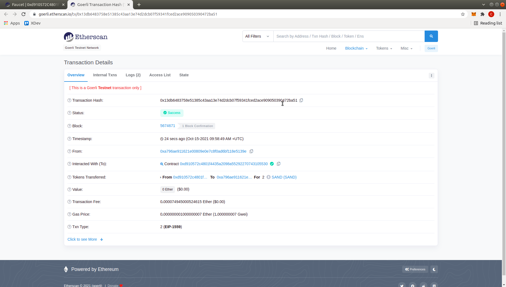
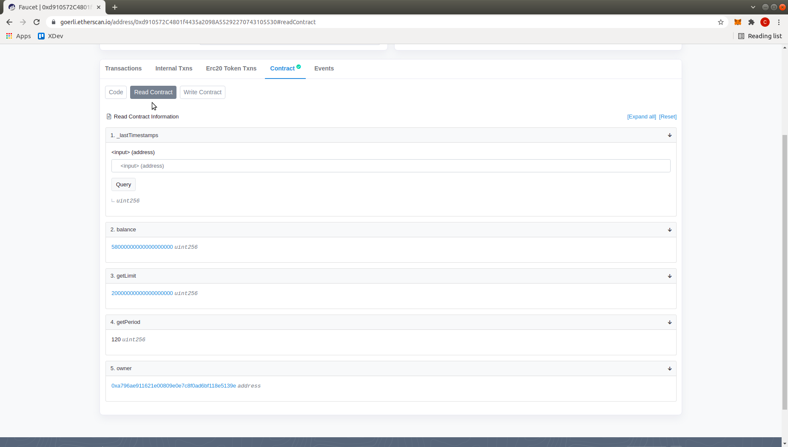

# [Faucet]((https://github.com/thesandboxgame/sandbox-smart-contracts/blob/master/src/solc_0.8/faucet/Faucet.sol))

## Introduction

The purpose of this contract is to create faucet on ERC-20 token.
This contract makes it possible to distribute sand or any ERC20 token to any user who requests it.

## Model

This contract is dealing with sand (or any ERC20 token).  
[ERC20](https://ethereum.org/en/developers/docs/standards/tokens/erc-20/) is the classic standard to represent fungible token.  

## Process

### Step 1

Sand admin or beneficiary transfer some sand from an address to the faucet contract address.

### Step 2

A user ask for an amount Sand (or ERC20 Token) through Faucet send method.

### Step 3

Faucet contract check that the asked amount is less that maximum amount authorized for a request.
If it is not the case the operation is reverted.

### Step 4

Faucet contract check that the time delta between each request for each user is much less than a parameter named period.
This period parameter is given as an argument of the constructor. If it is not the case the operation is reverted.

### Step 5

Faucet contract call transferFrom method of Sand (Erc20) contract with faucet deployer address, receiver address, and amount.
Amount is the minimun between balanceOf(deployer) and requested amount.

## Class diagram

```plantuml
@startuml
IERC20 <|-- Sand
Ownable <|-- Faucet
Faucet "many" *-- "1" IERC20 : contains

class Faucet {
  - IERC20 _ierc20
  + uint256 balance()
  + uint256 getLimit()
  + void setLimit(uint256 limit)
  + uint256 getPeriod()
  + void setPeriod(uint256 period)
  + void send(uint256 amount)
  + void retrieve(address receiver);
}

class Ownable {
}

class IERC20 {
  + uint256 totalSupply() 
  + uint256 balanceOf(address account)
  + bool transfer(address recipient, uint256 amount)
  + uint256 allowance(address owner, address spender)
  + bool approve(address spender, uint256 amount)
  + bool transferFrom(address sender, address recipient, uint256 amount)
}
@enduml
```

## Sequence diagram

### Send

```plantuml
@startuml
  actor "IERC20 beneficiary"
  actor User
  participant Faucet
  participant IERC20

  "IERC20 beneficiary" -> "IERC20" : transfer IERC20 token from ierc20 beneficiary address to faucet contract address
  "User" -> "Faucet" : call send with asked amount
  alt successful case
  "Faucet" -> "IERC20" : transfer funds from faucet deployer address to user address
  else the previous demand was too recent
  "Faucet" -> "User" : Reject
  else the asked amount demand was too recent
  "Faucet" -> "User" : Reject
  end
@enduml
```

### Retrieve

```plantuml
@startuml
  actor "IERC20 beneficiary"
  actor User
  participant Faucet
  participant IERC20

  "IERC20 beneficiary" -> "IERC20" : transfer IERC20 token from ierc20 beneficiary address to faucet contract address
  "User" -> "Faucet" : call retrieve with an address amount
  alt successful case
  "Faucet" -> "IERC20" : transfer funds from faucet deployer address to user address
  else Ownable: user is not the owner
  "Faucet" -> "User" : Reject
  end
@enduml
```
## Contract addresses

Goerli : 0xd910572C4801f4435a2098A55292270743105530
Rinkeby : 0x8e19Ca559eAB83a5201663E8a70cd0C2A9479663
Mumbai : 0x44DAAE71eF875d3B587206118E2Ff0071E315f43

## How to use Faucet on Goerli

### 1 Find contract on Goerli

go to https://goerli.etherscan.io/ and tap contract adress 0xd910572C4801f4435a2098A55292270743105530  

### 2 Access the contract

You can now see the contract with all its transactions.  
Click on contract link.

### 3 Go to the write section

Once on contract you can see the source code of the contract that has been validated.  
Go to the write section.  

### 4 Connect with Metamask

In the write section you will find all callable methods on the contract.  
You will have to connect your Metamask wallet first.

### 5 Select Metamask

A pop-up window opens and offers to connect your wallet.

### 6 Connection.

You are now logged in with your Metamask wallet.  
Make sure the address is for the correct account.  
It appears on the button.  

### 7 Get some Token.

To obtain tokens you must enter the amount in the send part.  
Remember to multiply the amount by 10 ^ 8.  
Because the amount is expressed in wei.

### 8 execute method.

Click on Write.

### 9 Sign the operation.

You will be asked to provide a signature with Metamask.

### 10 Wait for pending transaction.

Once the operation is executed you will receive a notification.  
By clicking on it you will be able to see the status of the transaction.  

### 11 Get information on Faucet Contract.

If you want you can get information about the faucet contract in the reading section.
you will find the minimum time to let pass between 2 calls to the send method of the faucet contract: getPeriod.  
you will also find the maximum amount you can claim on each call: getLimit.  
The balance of the contract is visible thanks to the balance method.  
These settings can be changed only by the contract deployer.   
To do this, you must use the associated setters in the writing section.  

### 12 Retrieve all tokens from Faucet Contract.

The contract developer will also be able to recover all of the tokens on any address using the retrieve method in the write section.  

